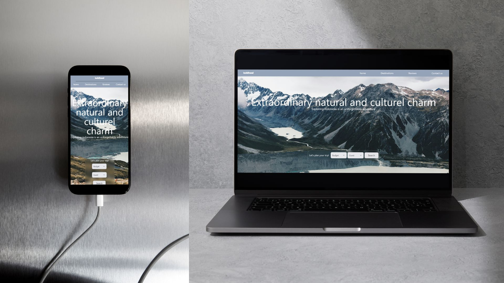
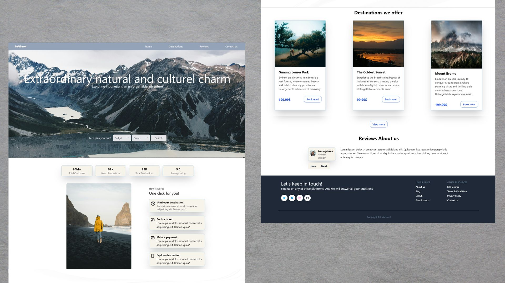

# IndoTravel - Explore the Beauty of Indonesia

Welcome to IndoTravel, your go-to destination for exploring the breathtaking beauty of Indonesia. Our travel agency offers incredible discounts and opportunities to discover the wonders of this diverse and vibrant country.

## Preview

## Features

- **Responsive Design:** IndoTravel website is designed to adapt to various screen sizes, ensuring a seamless experience across devices.
- **Easy Navigation:** With intuitive navigation, users can effortlessly browse through different destinations and packages.
- **Tailwind CSS:** The website is styled using Tailwind CSS, providing a clean and modern look.
- **AOS Animation:** Animated elements throughout the website, courtesy of AOS JavaScript library, add an extra layer of visual appeal.

## Getting Started

To explore IndoTravel website, simply visit [https://www.indotravel.com](https://www.indotravel.com) and start your journey to Indonesia's wonders.

## Technologies Used

- **HTML:** The backbone of the website's structure.
- **CSS:** Custom styling and layout implemented with CSS.
- **Tailwind CSS:** Utility-first CSS framework for streamlined styling.
- **AOS:** JavaScript library for smooth animations on scroll.

## Contributions

We welcome contributions to IndoTravel website. Whether it's fixing a bug, adding a new feature, or improving existing code, your contributions are highly appreciated. Please fork the repository, make your changes, and submit a pull request.

## Issues

If you encounter any issues or have suggestions for improvement, feel free to [open an issue](https://github.com/liliaazz/indotravel/issues) on GitHub.

---

Experience the magic of Indonesia with IndoTravel! Start planning your next adventure today.
